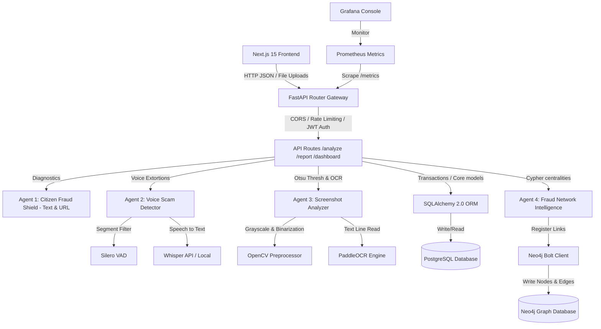

# FraudShield AI - Digital Public Safety Intelligence Platform

FraudShield AI is a modular, production-ready public safety platform designed to detect, prevent, and investigate extortive extortion rings, WhatsApp extortions, phishing links, and digital arrest networks. It serves both citizens (diagnostic tools, filing complaints) and law enforcement (heatmaps, network graphs, fraud syndicate clustering).

---

## Tech Stack Overview

- **Backend**: Python 3.12, [FastAPI](file:///c:/Users/rishi/fraudshield-ai/backend/api/main.py) (Asynchronous API endpoints), [SQLAlchemy 2.0](file:///c:/Users/rishi/fraudshield-ai/backend/database/session.py) (PostgreSQL ORM), [Alembic](file:///c:/Users/rishi/fraudshield-ai/backend/alembic/env.py) (Migrations), Redis (API rate limiting), uv package manager.
- **Frontend**: Next.js 15 (App Router), React 19, TypeScript, Tailwind CSS, Lucide icons, Framer Motion (premium glassmorphic styling, animations).
- **AI / Speech / Vision**: LangChain / LangGraph (Multi-agent orchestration), OpenAI GPT-5.5 / GPT-4o (structured JSON outputs), [Whisper](file:///c:/Users/rishi/fraudshield-ai/backend/services/speech.py) (Audio speech-to-text), [Silero VAD](file:///c:/Users/rishi/fraudshield-ai/backend/services/speech.py) (Voice Activity Detection), [OpenCV & PaddleOCR](file:///c:/Users/rishi/fraudshield-ai/backend/services/ocr.py) (Screenshot text extraction).
- **Graph Intelligence**: [Neo4j Community](file:///c:/Users/rishi/fraudshield-ai/backend/services/graph.py) (Bolt driver & APOC plugin for fraud clustering).
- **Monitoring**: Prometheus (Scraping `/metrics` metrics in FastAPI) and Grafana (Visualizing system dashboards).

---

## Architecture Diagram (Mermaid)



---

## Folder Directory Structure

```text
fraudshield-ai/
├── .github/
│   └── workflows/
│       └── ci-cd.yml             # GitHub Actions validation pipeline
├── backend/
│   ├── api/
│   │   ├── routers/
│   │   │   ├── auth.py           # User signups & JWT session issuance
│   │   │   ├── analyze.py        # Citizen threat analysis routes
│   │   │   ├── reports.py        # Filing and logging cyber complaints
│   │   │   └── dashboard.py      # Police analytics and Neo4j queries
│   │   ├── dependencies.py       # Auth extractions, SQLAlchemy session providers, RBAC checks
│   │   ├── main.py               # FastAPI bootstrapper, CORS, Prometheus metrics
│   │   └── uploads/              # Local uploads buffer directory
│   ├── core/
│   │   ├── config.py             # Pydantic Settings env loader
│   │   ├── security.py           # Direct bcrypt hashing & JWT signatures
│   │   └── logging.py            # Standardized console formatting
│   ├── database/
│   │   ├── session.py            # SQLAlchemy 2.0 async engine & pool
│   │   └── init_db.py            # Metadata table creator fallback
│   ├── models/                   # Clean Architecture SQLAlchemy models
│   ├── schemas/                  # Enforced Pydantic output contracts
│   ├── services/                 # Speech, OCR and Neo4j Bolt interfaces
│   ├── utils/                    # Redis async RateLimiter middleware
│   ├── tests/                    # Async Pytest suite (SQLite memory)
│   ├── Dockerfile
│   ├── requirements.txt
│   └── pytest.ini
├── frontend/
│   ├── src/
│   │   ├── app/                  # Next.js 15 pages (landing, dashboards, forms)
│   │   └── components/           # SVG Graph Network Visualizer panel
│   ├── Dockerfile
│   └── package.json
├── docker/
│   └── prometheus/
│       └── prometheus.yml        # Metrics scraping configuration
├── docker-compose.yml            # Production environment container stack
├── seed.py                       # High-fidelity DB seeding script
└── README.md
```

---

## Setup & Deployment Guide

### Prerequisites
- Docker & Docker Compose
- Node.js 20+ (optional, for local frontend dev)
- Python 3.12+ / `uv` package manager (optional, for local backend dev)

### Docker Compose Quickstart
Start all services (PostgreSQL, Redis, Neo4j, Prometheus, Grafana, Backend, and Frontend) in containerized mode:
```bash
docker compose up --build -d
```
The containers will initialize and automatically run the database schema migrations.

### Seeding Hackathon Dataset
To pre-populate users (Admin, Officer, Citizen), locations (cyber cell districts), scam templates, suspect trace phone numbers, and graph components, execute:
```bash
# Run PostgreSQL and Neo4j seeds via Docker
docker compose exec backend python seed.py
```

### Access Ports
- **Frontend Dashboard**: `http://localhost:3000`
- **Backend FastAPI Docs**: `http://localhost:8000/docs`
- **Neo4j Browser Console**: `http://localhost:7474` (Credentials: `neo4j` / `password123`)
- **Prometheus Metrics**: `http://localhost:9090`
- **Grafana Dashboards**: `http://localhost:3002`

---

## Detailed API Specifications

See FastAPI `/docs` for parameters. Key endpoints:

| Method | Endpoint | Description | Payload shape |
|---|---|---|---|
| `POST` | `/auth/signup` | Registers a new user account | `{ email, password, full_name, role, district }` |
| `POST` | `/auth/login` | Issues a bearer JWT session token | Form URLencoded `{ username, password }` |
| `POST` | `/analyze/text` | Scams indicator diagnostics on text | `{ text }` |
| `POST` | `/analyze/url` | Verifies suspicious phishing domain links | `{ url }` |
| `POST` | `/analyze/image` | Extracts text from screenshots using OCR | Form Multipart `{ file }` |
| `POST` | `/analyze/audio` | Slices static and transcribes voice notes | Form Multipart `{ file }` |
| `POST` | `/report` | Logs a cyber complaint to PG & Neo4j graph | `{ title, description, scam_category, suspect_phone, ... }` |
| `GET` | `/dashboard` | Returns summaries (totals, types, and districts) | Headers: None |
| `GET` | `/analytics` | Timeline bar metrics and coordinates | Headers: None |
| `GET` | `/metrics` | Prometheus scraper endpoint | Headers: None |
| `GET` | `/fraud-network` | Traces Neo4j nodes, links and active clusters | Headers: None |

---

## Unified AI JSON Response Schema
Every Agent return is guaranteed to match the following schema:
```json
{
  "risk_score": 92.5,
  "confidence": 0.94,
  "reasoning": "Detected high-risk extortion phrases linked to Digital Arrest. CBI impersonation keyword identified.",
  "recommendation": "Hang up WhatsApp video call immediately. Real CBI agents do not enforce digital arrest via chat.",
  "evidence": {
    "matched_keywords": ["cbi", "digital arrest", "money laundering"],
    "extracted_text": "CBI Officer: You are under investigation for money laundering..."
  },
  "category": "Digital Arrest"
}
```

---

## Running the Tests
To execute backend verification checks:
```bash
cd backend
$env:PYTHONPATH=".."
uv run pytest
```
All 6 tests (testing auth flows, structured text scans, url checks, screenshots, and audio VAD) will run against the SQLite in-memory engine.
